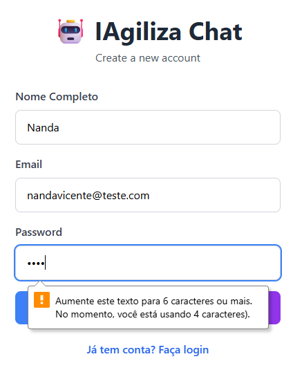

### Ambiente de Teste
- **Data:** 30 de outubro de 2025
- **Backend:** http://localhost:3333
- **Frontend:** http://localhost:5173
- **Banco de Dados:** PostgreSQL (Docker)

---

##  Resultados dos Testes

### 1. Fluxo de Autenticação 

#### Página de Login

*Interface de login do usuário com validação de formulário*

#### Página de Cadastro

*Cadastro de usuário com campos para nome, e-mail e senha*

- [x] Cadastro de usuário com validação
- [x] Login de usuário com credenciais
- [x] Geração e armazenamento de token JWT
- [x] Redirecionamento de rotas protegidas quando não autenticado
- [x] Autenticação persistente (persiste após atualização da página)
- [x] Funcionalidade de logout

### 2. Funcionalidade de Chat 

#### Estado de Chat Vazio

*Estado inicial do chat, solicitando ao usuário que inicie uma conversa*

#### Chat Ativo com Respostas de IA

*Chat em tempo real mostrando mensagens do usuário (azul) e respostas de IA (branco)*

#### Suporte a Múltiplos Chats

*Suporte para criar e gerenciar múltiplas conversas*

- [x] Enviar mensagens para IA
- [x] Receber respostas de IA
- [x] Exibição de mensagens em tempo real
- [x] Suporte a múltiplos chats
- [x] Persistência do histórico de mensagens
- [x] Exibição de carimbo de data/hora

### 3. Perfil do Usuário 

#### Modo de Visualização do Perfil

*Exibição do perfil do usuário com informações da conta*

#### Modo de Edição do Perfil

*Interface de edição de perfil com opções de salvar/cancelar*

- [x] Visualizar perfil do usuário
- [x] Editar nome do perfil
- [x] Atualizar perfil com integração de API
- [x] Mensagens de feedback de sucesso

### 4. UI/UX 
- [x] Design responsivo
- [x] Estados de carregamento durante operações assíncronas
- [x] Tratamento de erros com mensagens amigáveis ​​ao usuário
- [x] Validações de formulário (HTML5 + personalizadas)
- [x] Transições e animações suaves
- [x] Navegação intuitiva

### 5. Segurança 
- [x] Autenticação JWT
- [x] Endpoints de API protegidos
- [x] Proteção de rotas no lado do cliente
- [x] Validação de token em solicitações
- [x] Tratamento seguro de senhas (backend)

### 6. Persistência de Dados 
- [x] Mensagens armazenadas no banco de dados
- [x] Dados do usuário Persistência
- [x] Histórico de bate-papo mantido
- [x] Persistência de sessão (localStorage)

### Ambiente de Desenvolvimento

#### Servidor Backend em Execução

*Servidor Fastify em execução na porta 3333*

#### Servidor de Desenvolvimento Frontend

*Servidor de desenvolvimento Vite em execução na porta 5173*

#### Contêiner de banco de dados

*PostgreSQL em execução em um contêiner Docker*
Enviar feedback
Painéis laterais
Histórico
Salvas

##  Resultados dos Testes dark/light

### 1. Fluxo de Autenticação 

#### Página de Login

*Interface de login do usuário com validação de formulário*

### 2. Funcionalidade de Chat 

*Cadastro de usuário com campos para nome, e-mail e senha*

### 3. Perfil do Usuário 

#### Modo de Edição do Perfil

*Interface de edição de perfil com opções de salvar/cancelar*

- [x] Visualizar perfil do usuário
- [x] Editar nome do perfil
- [x] Atualizar perfil com integração de API
- [x] Mensagens de feedback de sucesso

